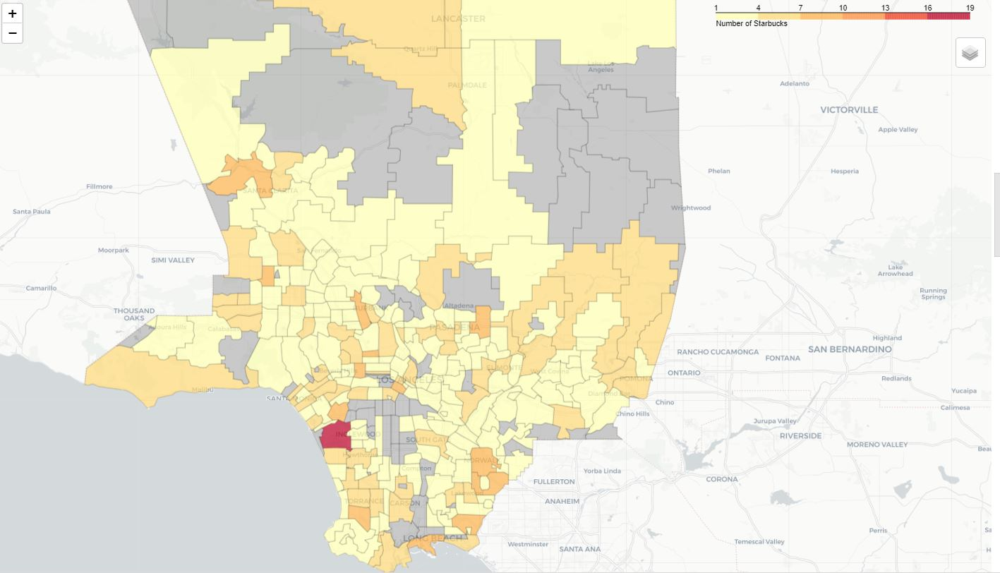
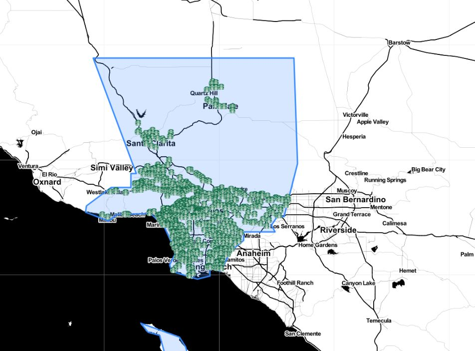
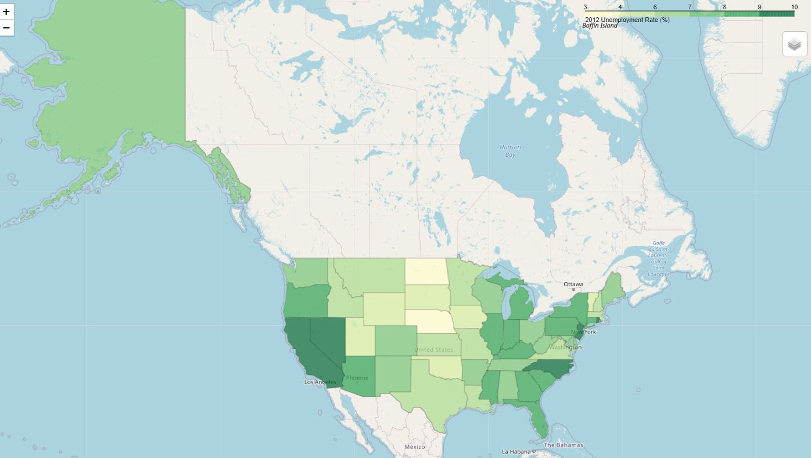

# Lab6: Interactive Map
## Introduction

This tutorial uses a Python library called Folium and pandas to create several interactive maps. The first two maps are:
* A choropleth map which shades in LA County zip codes based on how many Starbucks are contained in each one (and you'll learn why this is a terrible idea!)
* A precise map of all Starbucks' locations in LA County

The third map is the map the unemployment rate by state by 2012.

## Result
The first map shows the number of Starbucks in each zip code.

The second map shows the distribution of Starbucks in LA.

The Third map shows the unemployment rate by state by 2012.

